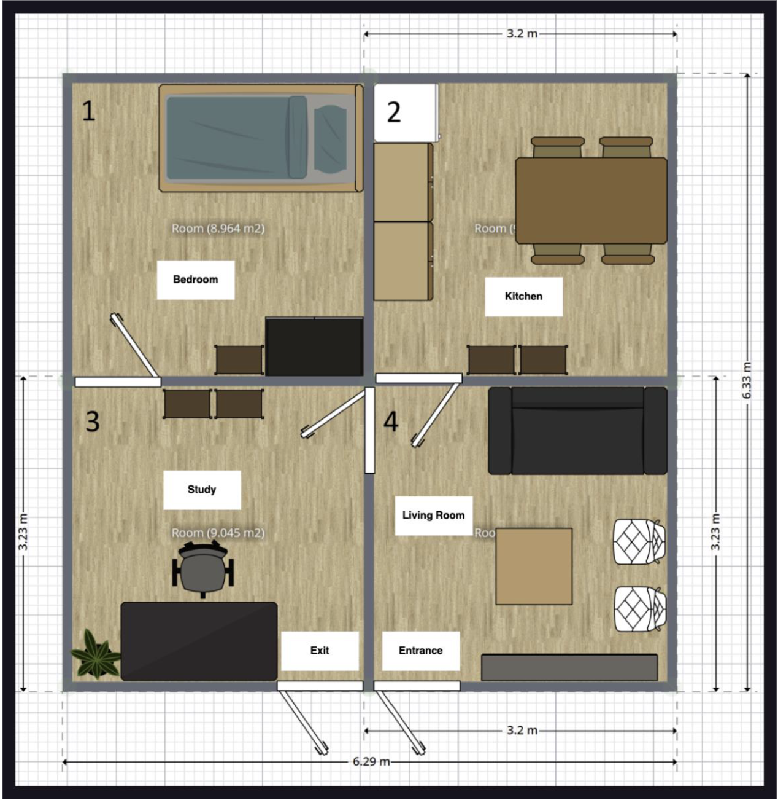
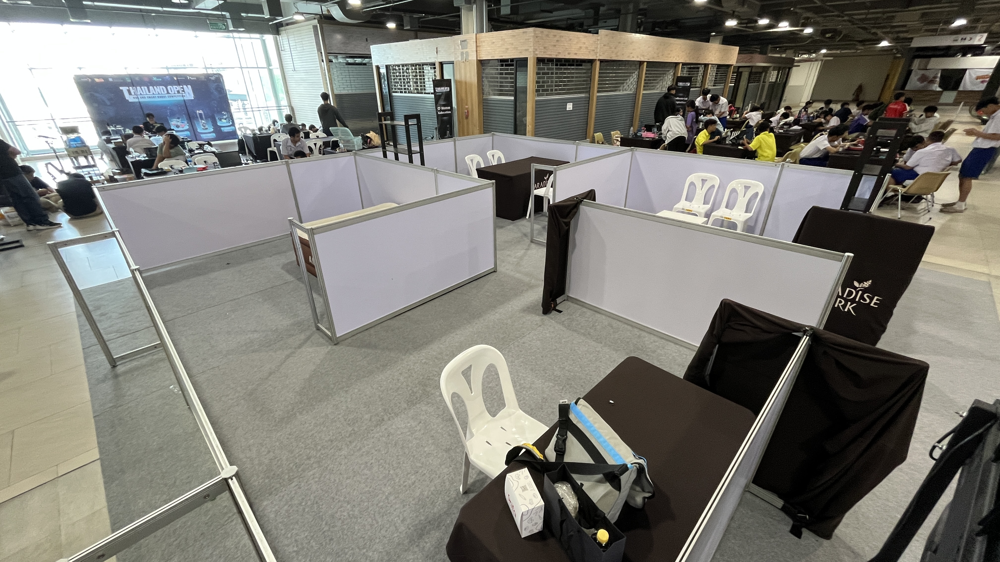
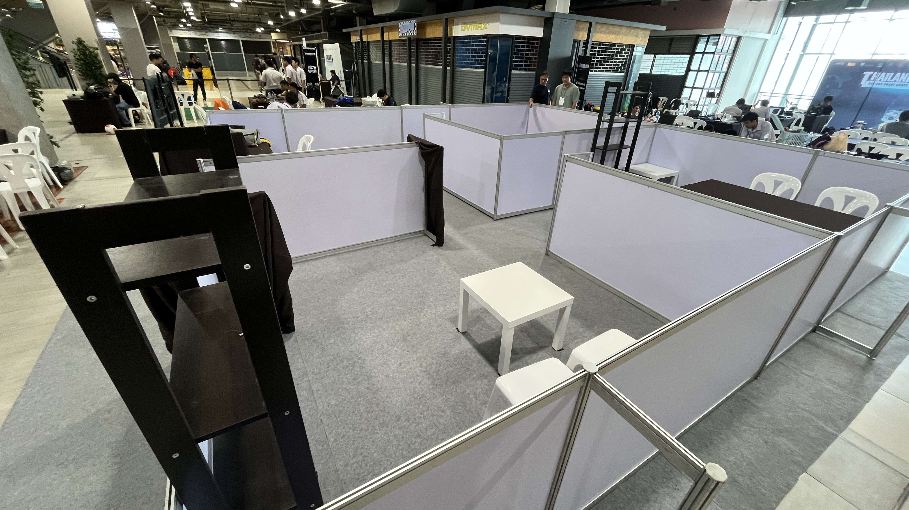

# Thailand Open ROS and Smart Robot Competition 2026

## Table of contents
- [Rules](#rules)
- [Arena map](#arena-map)
- [Schedules](./markdown/schedules.md)
- [Names](./markdown/names.md)
- [Items](./markdown/items.md)
- [Practice Sheet](https://docs.google.com/spreadsheets/d/1cA-P9It05Q9N-lKJcRblpGrrJf1GOMNn8Q0jEqNWG4s/edit?usp=sharing)
- [Score](#score)

## Rules
- [Thailand Open Platform 2026 Rules](./documents/RoboCupAtHomeTHRule2026.pdf)

## Arena map

> All of the furniture might not be in these positions, but the room names remain the same.

### Real Arena map

## Teams
| Team Name |
| :--- |
| FireWork |
| ISOLATE |
| CLEANEST |
| KRIS |
| Noname |
| Return To Monkey |
| BCC Robot |

## Score

### Final score (Best of all trials)
| Team name | Carry My Luggage | Storing groceries | Strickler for the rules | Total |
| :--- | :---: | :---: | :---: | :---: |
| FireWork | 300 | 0 | 450 | 750 |
| ISOLATE | 100 | 0 | 0 | 100 |
| CLEANEST | 800 | 0 | 250 | 1050 |
| KRIS | -500 | -500 | -500 | -1500 |
| Noname | 100 | 0 | 0 | 100 |
| Return To Monkey | 100 | 0 | 0 | 100 |
| BCC Robot | 150 | 0 | 0 | 150 |

### Raw score

| Team name | Carry My Luggage (Trial 1) | Carry My Luggage (Trial 2) | Storing groceries (Trial 1) | Storing groceries (Trial 2) | Strickler for the rules (Trial 1) | Strickler for the rules (Trial 2) |
| :--- | :---: | :---: | :---: | :---: | :---: | :---: |
| FireWork  | 300   | 150   | 0     | 0     | 0     | 450   |
| ISOLATE   | 0     | 100   | 0     | 0     | 0     | 0     |
| CLEANEST  | 200   | 800   | 0     | 0     | 250   | 250   |
| KRIS      | -500  | -500  | -500  | -500  | -500  | -500  |
| Noname    | 0     | 100   | 0     | 0     | 0     | 0     |
| Return To Monkey | 0  | 100   | 0     | 0     | 0     | 0     |
| BCC Robot | 0     | 150   | 0     | 0     | 0     | 0     |
